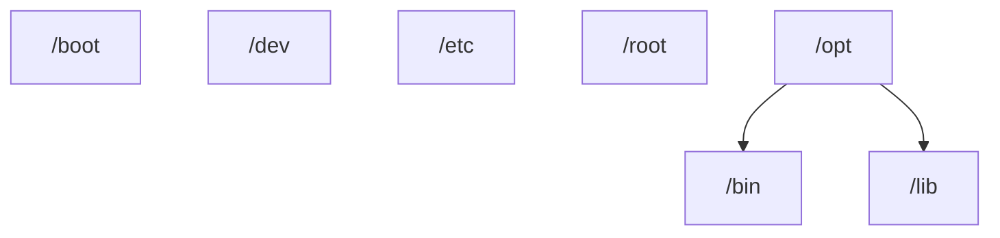
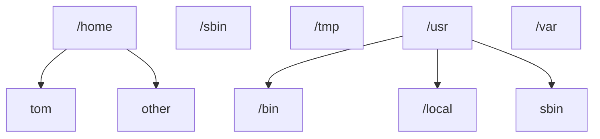
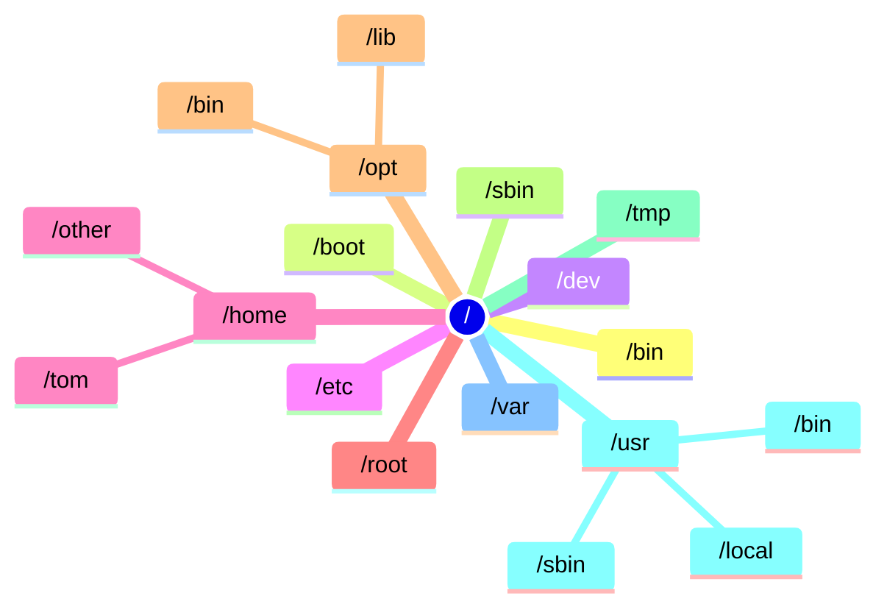

/bin = binairies (ls, mkdir, rm ...) (/bin -> /usr/bin)
/sbin = idem for SU (deluser...)
/usr = originally where was home directory
/opt = optionnal (additional software)
/etc = config files
/home
/boot = files to boot a computer
/lib
/tmp = temp files used by apps while running
/var = logs, tasks, tmpfiles between reboot, snap
/dev = device files (media & mnt)
/proc = sys de fichiers virtuels . bcp de choses sur le systeme et les processus (+infos sur CPU -> /proc/cpuinfo, la memoire -> /proc/meminfo, les partitions /proc/partitions)

